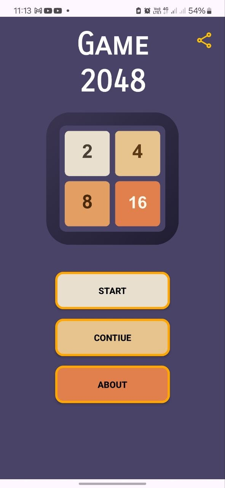
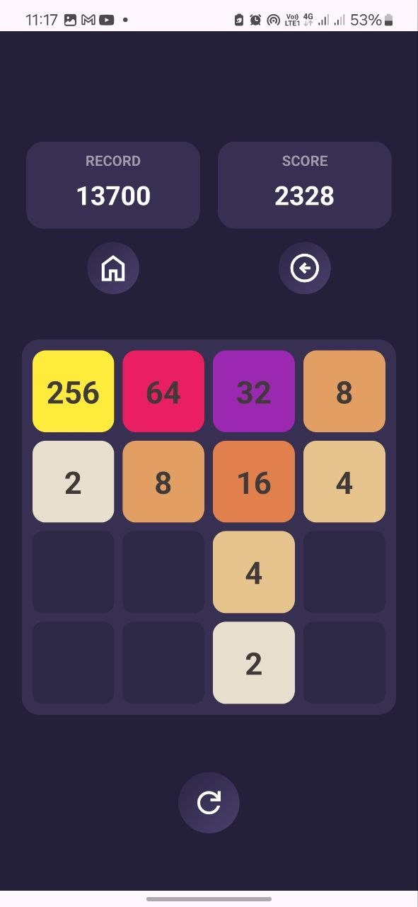
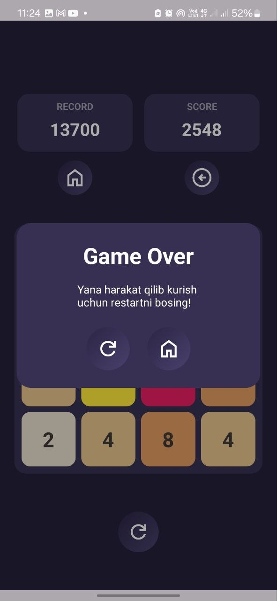
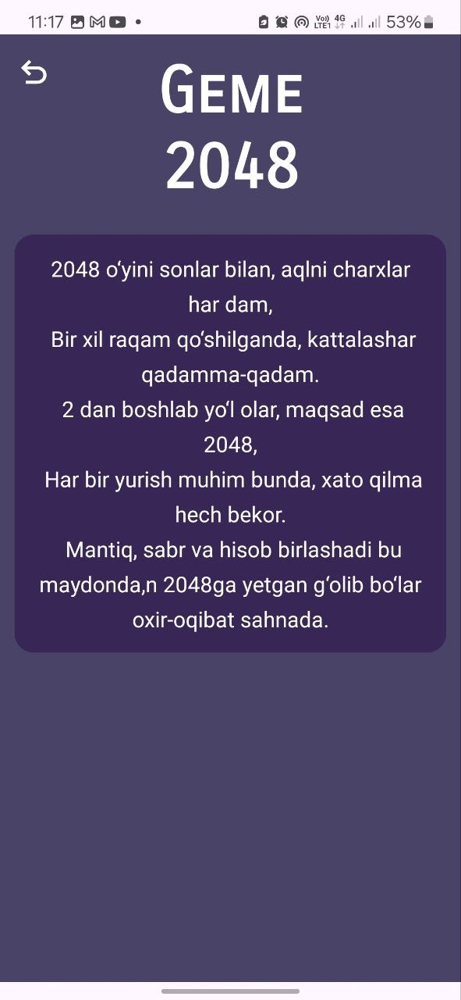
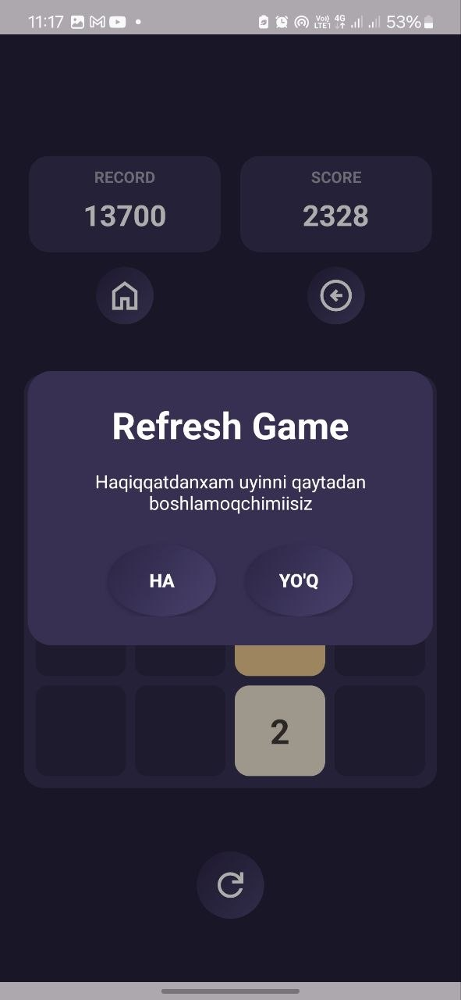

# 2048 Game for Android 🎮

A classic **2048 puzzle game** built for Android using Kotlin and modern Android architecture guidelines.

---

## 🚀 Features

* **Smooth UI/UX:** Intuitive swipe gestures and smooth tile movements.
* **Game Logic:** Efficient matrix algorithms for tile merging and grid updates.
* **State Management:** High score tracking and automatic saving of current game state.
* **Optimized Performance:** Fast response times and low memory consumption.

---
## 📱 Screenshots

| Main Menu | Gameplay | Game Over | 
| About Game | Refresh Game |
|  |  |  | |  |
---
## 🛠 Tech Stack & Architecture

* **Language:** Kotlin
* **UI:**  XML Layouts
* **Local Data:**  SharedPreferences
